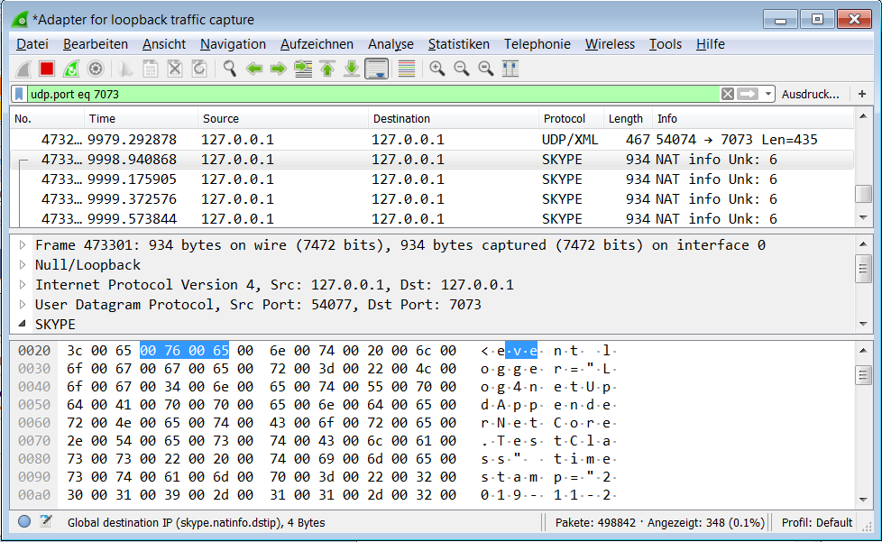

# Log4netUdpAppender
When using log4net.logging.UdpAppender under netcoreapp3.0, logging messages are not properly emitted due to the fact that log4net uses Unicode as the default encoding for netcoreapp3.0.
This results in UDP packets which cannot be properly interpreted.

